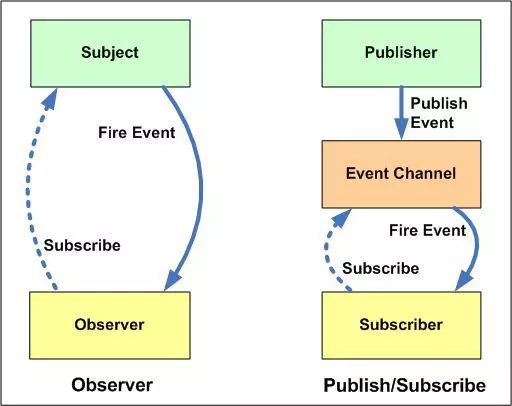

### 发布订阅模式
* 发布-订阅模式定义了对象间一种一对N的关系，观察者们同时监听某一个对象相应的状态变换，一旦变化则通知所有观察者，从而触发观察者相应的事件。

* 优点：
    * 支持简单的广播通信，自动通知已订阅的对象。
    * 实现发布者与订阅者之间更深层的解耦。
* 缺点：
    * 过多使用发布订阅模式，会增加维护的难度。

#### 实现思路
* 创建一个类Event
* 在该类添加属性_events作为调度中心。
* on方法用来把函数添加到缓存列表中，即订阅者注册事件。
* emit方法取到arguments里第一个参数作为事件type，根据这个type去执行对应缓存列表中的函数。发布者发布事件到调度中心，调度中心处理代码。
* off方法可以根据type值取消订阅。
* once方法只监听一次，调用完毕后删除缓存函数（只能订阅一次）。

#### 1.发布-订阅模式简单实现：包含添加订阅on，发布订阅emit，取消订阅off;

```
function Event(){
    this._events = {};
}

Event.prototype.on =  function(type, fn){
    if(this._events[type]){
        this._events[type].push(fn);
    } else {
        this._events[type] = [fn];
    }
    return this;
}

Event.prototype.emit = function(){
    let _this = this;
    let type = Array.prototype.shift.call(arguments);
    let arr = this._events[type];
    arr.forEach(element => {
        element.apply(_this, arguments);
    });
    return _this;
}

Event.prototype.off = function(type, fn){
    let _this = this;
    let fns = this._events[type];
    
    for(let i = 0, len= fns.length; i<len; i++){
        let _fn = fns[i];
        if(_fn === fn){
            fns.splice(i, 1);
            break;
        }
    }
    return _this;
}

// Test

let ev = new Event();
ev.on('read', function(title, author){
    console.log('我要订阅你的内容:', title, author);
});

ev.emit('read', '测试标题', 'jeason');
console.log('------------------------------------------');

// 如果在emit即发布后再订阅，这个订阅并不会执行。
let fn = function (title, author) {
    console.log('在发布后再订阅：', title, author);
};
ev.on('read', fn);

ev.emit('read', '测试标题', 'jeason');
console.log('------------------------------------------');

ev.off('read', fn);
ev.emit('read', '测试标题', 'jeason');
console.log('------------------------------------------');
```

```
控制台输出：

我要订阅你的内容: 测试标题 jeason
------------------------------------------
我要订阅你的内容: 测试标题 jeason
在发布后再订阅： 测试标题 jeason
------------------------------------------
我要订阅你的内容: 测试标题 jeason
------------------------------------------
```

#### 发布-订阅模式的进阶实现;
* 添加once方法
```
Event.prototype.once= function(type, fn){
    let _this = this;
    function one(){
        _this.off(type, one);
        fn.apply(_this, arguments);
    }
    _this.on(type, one);
    return _this;
}
```

* 完善off取消事件的参数
```
Event.prototype.off = function (type, fn) {
    let _this = this;
    let fns = this._events[type];

    // 如果缓存列表中没有相应的fn,返回false；
    if(!fns) return false;
    // 如果没有指定fn,就将对应type的fn都清空
    if(!fn){
        fns && (fns.length = 0);
    }else{
        for (let i = 0, len = fns.length; i < len; i++) {
            let _fn = fns[i];
            if (_fn === fn) {
                fns.splice(i, 1);
                break;
            }
        }
    }
 
    return _this;
}
```
整体代码见 [pubsub01.js](./pubsub01.js)

#### 使用ES6实现


#### Vuex中的应用

#### 发布-订阅模式与观察者模式的区别

很多地方都说发布-订阅模式是观察者模式的别名，但是他们真的一样吗？是不一样的。

上图：



**观察者模式**：观察者（Observer）直接订阅（Subscribe）主题（Subject），而当主题被激活的时候，会触发（Fire Event）观察者里的事件。

**发布订阅模式**：订阅者（Subscriber）把自己想订阅的事件注册（Subscribe）到调度中心（Event Channel），当发布者（Publisher）发布该事件（Publish Event）到调度中心，也就是该事件触发时，由调度中心统一调度（Fire Event）订阅者注册到调度中心的处理代码。

**差异：**

* 在观察者模式中，观察者是知道 Subject 的，Subject 一直保持对观察者进行记录。然而，在发布订阅模式中，发布者和订阅者不知道对方的存在。它们只有通过消息代理进行通信。
* 在发布订阅模式中，组件是松散耦合的，正好和观察者模式相反。
* 观察者模式大多数时候是同步的，比如当事件触发，Subject 就会去调用观察者的方法。而发布-订阅模式大多数时候是异步的（使用消息队列）。
* 观察者模式需要在单个应用程序地址空间中实现，而发布-订阅更像交叉应用模式。


